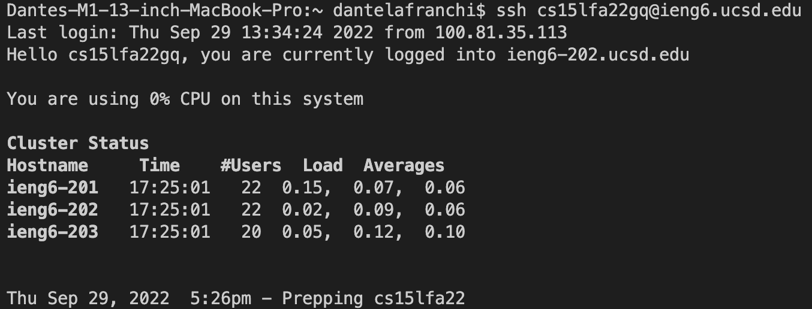

# Lab Report Week 1 - Remote Access and the Filesystem

## Step 1 - Installing VScode
I already had Visual Studio Code installed but I remember it being a pretty easy process. VS Code is free and there were many tutorials on youtube to help me learn all about the different features in VS Code.

 

## Step 2 - Remotely Connecting
I had a lot of trouble remotely connecting to the other computer. I had to reset my password four times, but it was a great feeling when my password was finally accepted. Once logged in, the terminal displayed the clusters on the remote computer that I was logged into and how much of their power I was currently using (basically nothing at this point).

## Step 3 - Trying Some Commands
I ran the "ls -a" command which displayed the names of all the files in the current directory and the names of the hidden files. I ran the "pwd" command which displayed the path to get to the current directory. I used the "cat" command to display the contents of a file "hello.txt" on the remote computer.

## Step 4 - Moving Files with scp
I used the "scp" command to move the WhereAmI.java file I had on my local computer to the remote computer. I used the "javac" command to compile the file and then I used the "java" command to run the file. When the file ran, the terminal displayed some facts about the remote computer: the operating system, the username, the home directory, and the current directory. I exited ssh and ran the same file on my local computer, and you can see how the operating system, username, and directories were all different.

## Step 5 - Setting an SSH Key
To use the "ssh" and "scp" commands without a password, I ran the ssh-keygen program on the local computer which created a private key (stored on local computer) and a public key (to be stored on remote computer). Then, I logged into the remote computer and created a new directory called authorized_keys using the "mkdir" command. I logged out and used the "scp" command to move the file with the public key, id_rsa.pub, to the authorized_keys directory in the remote computer. After this, I was able to use the "ssh" and "scp" commands with no password.

## Step 6 - Optimizing Remote Running
I ran the "open -a" command to open the WhereAmI.java file on my local computer and edit it. I ran the "scp" command to copy the WhereAmI.java file to the remote computer; I put a semicolon after this command to run the "javac" command to compile the WhereAmI.java file on the same line. I used the up-arrow key to copy my last command then highlighted some of the text and replaced it with the "ssh" command and the "java" command surrounded by quotation marks to run the WhereAmI.java file on the remote computer and then exit.
