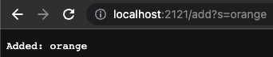
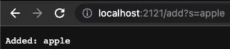
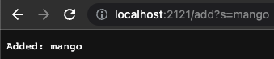
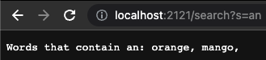
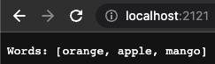

# Lab Report Week 3 - Servers and Bugs

## Part 1
Code from Simplest Search Engine from week 2:
```
import java.io.IOException;
import java.net.URI;
import java.util.ArrayList;

class Handler implements URLHandler {
    // The one bit of state on the server: a number that will be manipulated by
    // various requests.
    ArrayList<String> strs = new ArrayList<>();

    public String handleRequest(URI url) {
        if (url.getPath().equals("/")) {
            return String.format("Words: " + strs);
        } else if (url.getPath().contains("/add")) {
            String[] parameters = url.getQuery().split("=");
                if (parameters[0].equals("s")) {
                    strs.add(parameters[1]);
                    return String.format("Added: " + parameters[1]);
                }
        } else if (url.getPath().contains("/search")) {
            String containsSubString = "";

            String[] parameters = url.getQuery().split("=");
                if (parameters[0].equals("s")) {
                    for (String str : strs) {
                        if (str.contains(parameters[1])) {
                            containsSubString += str + ", ";
                        }
                    }
                }
            return String.format("Words that contain " + parameters[1] + ": " + containsSubString);
        }

        return "404 Not Found!";
    }
}

public class SearchEngine {
    public static void main(String[] args) throws IOException {
        if(args.length == 0){
            System.out.println("Missing port number! Try any number between 1024 to 49151");
            return;
        }

        int port = Integer.parseInt(args[0]);

        Server.start(port, new Handler());
    }
}
```
In the image below, I added "orange" to the list of words. The handleRequest method was called, and the url was passed in as an argument. This method checked if the URL contained any key words which would indicate which action I was trying to take. The method saw I did a query with the keyword add, so the method added the word "orange" (what I put after the = sign in the URL) to the ArrayList strs which is a field in my class. strs now contains "orange".
<br>


In the image below, I added "apple" to the list of words. Just like the previous add query, the handleRequest method was called and the argument was the URL. Once the method processed my query, the word "apple" was added to the ArrayList strs. strs now contains "orange" and "apple".
<br>


In the image below, I added "mango" to the list of words. Just like the previous add query, the handleRequest method was called and the argument was the URL. Once the method processed my query, the word "mango" was added to the ArrayList strs. strs now contains "orange", "apple", and "mango". 
<br>


In the image below, I checked if the words in strs contained the substring "an". The handleRequest method was called, and the URL was passed in as an argument. The method saw I did a query with the keyword search, so it used a for each loop to check if each of the individual strings contained the substring "an". The method created a new string which included all the words that contained a specific substring, and displayed it. strs was not modified by this request.
<br>


In the image below, I displayed the contents of strs. The handleRequest method was called, and the URL was passed in as an argument. There was no query, so it displayed the contents of strs ("orange, apple, mango"). The URL for this was just localhost:2121. strs was not modified by this request.
<br>


## Part 2

### First Bug
The first bug was in the reverseInPlace() method in the ArrayExamples.java file. The failure-inducing input was [3, 5, 4, 8]. The symptom was [8, 4, 4, 8]. The correct output is [8, 4, 5, 3]. This method took the second half of the array, reversed it, and put it in the first half of the array. This method didn't reverse the second half of the array. 

The buggy method was: 
```
static void reverseInPlace(int[] arr) {
    for(int i = 0; i < arr.length; i += 1) {
        arr[i] = arr[arr.length - i - 1];
    }
}
```

As each iteration of the for loop ran, the array looked like this: 

> arr[0] = arr[4 - 0 - 1] = arr[3] = 8

> arr[1] = arr[4 - 1 - 1] = arr[2] = 4

> arr[2] = arr[4 - 2 - 1] = arr[1] = 4

> arr[3] = arr[4 - 3 - 1] = arr[0] = 8


To fix this bug, I started by only iterating over half of the array length. Then, I stored arr[i] in a temporary variable, changed the value of arr[i], and then changed the value of arr[arr.length - i - 1] to the temporary variable. This new method effectively starts at the beginning of the array and switches its value with the end of the array. Then it switches the second value in the array with the second to last value in the array. It does this until it reaches the middle, and has therefore finished reversing the array. 

The fixed method is:
```
static void reverseInPlace(int[] arr) {
    for(int i = 0; i < arr.length / 2; i += 1) { 
        int temp = arr[i];
        arr[i] = arr[arr.length - i - 1];
        arr[arr.length - i - 1] = temp;
    }
}
```

### Second Bug
The second bug was in the filter() method in the ListExamples.java file. The failure-inducing input was ["houses", "dog", "CSE15L", "cat", "San Diego"]. The symptom was ["cat", "dog"]. The correct output is ["dog", "cat"]. This method checks if each String in the ArrayList has a length less than 5, and if so, adds that String to a new ArrayList at index 0. Although this method is correctly filtering the ArrayList, it is adding the filtered words to the new ArrayList in the wrong order. It is adding them to index 0, when it should just be adding them to the end of the ArrayList. This is why "cat" is before "dog" in the incorrectly filtered ArrayList.

The buggy method was: 
```
static List<String> filter(List<String> list, StringChecker sc) {
    List<String> result = new ArrayList<>();
    for(String s: list) {
        if(sc.checkString(s)) {
            result.add(0, s);
        }
    }
    return result;
}
```

To fix this bug, I changed which version of the List add method is being used. I changed the add method to only have one parameter (the string to add) from two parameters (the index to add the string at, the string to add). This way, the filtered strings were added in the correct order. 

The fixed method is:
```
static List<String> filter(List<String> list, StringChecker sc) {
    List<String> result = new ArrayList<>();
    for(String s: list) {
        if(sc.checkString(s)) {
            result.add(s);
        }
    }
    return result;
}
```