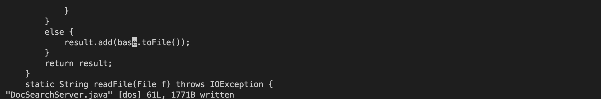

# Vim
## Part 1
Task: In DocSearchServer.java, change the name of the start parameter of getFiles, and all of its uses, to instead be called base.

> vim DocSearchServer.java 

I typed this to open the file DocSearchServer.java in Vim. 

> /start\<Enter> 

I typed this to search DocSearchServer.java for the first occurrence of "start" and pressed \<Enter> move my cursor there.

> ce

I typed this to delete the letter my cursor was on, "s", through the end of the word  "start".

> base\<Esc>

When I typed "b", I moved into insert mode. I then typed "ase" followed by pressing \<Esc> to get back to normal mode.

> n

I typed this to move my cursor to the next occurrence of "start" in DocSearchServer.java.

.png)

> .

I typed this to repeat my last edit which was typing "ce" followed by "base". This operator deleted the word "start" and replaced it with "base" in one keystroke.

.png)

> n

I typed this to move my cursor to the next occurrence of "start" in DocSearchServer.java.

.png)

> .

I typed this to repeat my last edit which was typing "ce" followed by "base". This operator deleted the word "start" and replaced it with "base" in one keystroke.

.png)

> :w\<Enter>

I typed this to save the edited DocSearchServer.java.

## Part 2

### Approach #1
It took me 55 seconds to make the edit in VS Code, scp DocSearchServer.java to the remote server and run it there. 

### Approach #2
It took me 40 seconds to make the edit through vim when already logged into the remote server through ssh.

### Conclusion
There weren't any difficulties that came up, but the times would probably be different if I didn't have most of the commands ready to go (so that all I had to was press the up arrow a couple times). To make the edit in VS Code, I used a similar approach to making the edit in Vim by using command-f instead of the /\<term> feature. If I was running a program remotely, I would prefer approach one because most edits will probably be more complex than replacing every occurrence of one word with another word. These more complex edits would make Vim take much longer in my opinion. If the edit I have to do to the project is actually writing code and not just changing the name of something, I would prefer approach one. Vim can be fun to use for basic things (with the dot operator), but I wouldn't want to use it for my job.