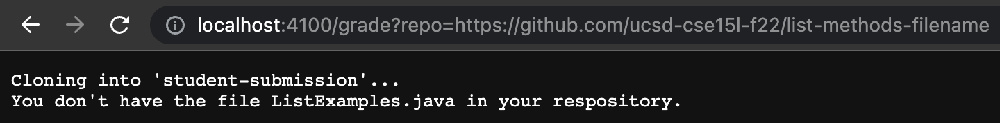

# Auto-grader
### Grade.sh
```
rm -rf student-submission
rm -rf student-code-and-test
rm -rf student-code-and-test/lib
git clone $1 student-submission

CP=".:lib/hamcrest-core-1.3.jar:lib/junit-4.13.2.jar"
mkdir student-code-and-test
cp TestListExamples.java student-code-and-test

cd student-submission

if [[ ! -f "ListExamples.java" ]]
then 
    echo "You don't have the file ListExamples.java in your respository."
    exit 1
fi

cp ListExamples.java ../student-code-and-test
cd ../student-code-and-test


mkdir lib
cp ../hamcrest-core-1.3.jar ./lib
cp ../junit-4.13.2.jar ./lib

javac -cp $CP *.java 2> errors.txt

if [[ ! $? -eq 0 ]]
then 
    echo "ListExamples.java didn't compile."
    exit 1
fi

java -cp $CP org.junit.runner.JUnitCore TestListExamples > output.txt

if grep --quiet "OK (4 tests)" output.txt
then
    echo "PASSED 4/4 TESTS"
    echo "Your score is 100%"  
elif grep --quiet "Failures: 1" output.txt
then
    echo "PASSED 3/4 TESTS"
    echo "Your score is 75%"  
elif grep --quiet "Failures: 2" output.txt
then
    echo "PASSED 2/4 TESTS"
    echo "Your score is 50%"  
elif grep --quiet "Failures: 3" output.txt
then
    echo "PASSED 1/4 TEST"
    echo "Your score is 25%"  
fi
```

### Example Grades of Student Submissions

 




### Trace
I am tracing is https://github.com/ucsd-cse15l-f22/list-methods-lab3 in grade.sh. 

Lines 1-3: No standard output or standard error. Each return code was 0.

Line 4: The standard output was 
```
Cloning into 'student-submission'...
remote: Enumerating objects: 3, done.
remote: Counting objects: 100% (3/3), done.
remote: Compressing objects: 100% (2/2), done.
remote: Total 3 (delta 0), reused 3 (delta 0), pack-reused 0
Receiving objects: 100% (3/3), done.
```
No standard error. Return code was 0.

Line 7-10: No standard output or standard error. Each return code was 0.

Line 12: The condition for this if statement was false because this repository does have a file named ListExamples.java.

Lines 13-16: These lines didn't run because the condition for the if statement on line 12 was false.

Lines 18-25: No standard output or standard error. Each return code was 0.

Line 27: The condition for this if statement was false because the exit code from the previous javac command was 0.

Lines 28-31: These lines didn't run because the condition for the if statement on line 27 for false.

Line 33: The standard output was 
```
JUnit version 4.13.2
.E..E.
Time: 0.008
There were 2 failures: 1) testfilter1(TestListExamples)
java.lang.AssertionError: expected:<[dog, cat]> but was:<[cat, dog]>
	at org.junit.Assert.fail(Assert.java:89)
	at org.junit.Assert.failNotEquals(Assert.java:835)
	at org.junit.Assert.assertEquals(Assert.java:120)
	at org.junit.Assert.assertEquals(Assert.java:146)
	at TestListExamples.testfilter1(TestListExamples.java:28)
2) testfilter3(TestListExamples)
java.lang.AssertionError: expected:<[cat, dog, cat, cat]> but was:<[cat, cat, dog, cat]>
	at org.junit.Assert.fail(Assert.java:89)
	at org.junit.Assert.failNotEquals(Assert.java:835)
	at org.junit.Assert.assertEquals(Assert.java:120)
	at org.junit.Assert.assertEquals(Assert.java:146)
	at TestListExamples.testfilter3(TestListExamples.java:61)

FAILURES!!!
Tests run: 4,  Failures: 2
``` 
No standard error. Return code was 0.

Line 35: This if statement didn't run because the grep command returned 1 as an exit code which means it didn't find the string in the file and the condition for the if statement is false because 1 means false.

Lines 36-38: These lines didn't run because the condition for the if statement on line 35 was false.

Line 39: This if statement didn't run because the grep command returned 1 as an exit code which means it didn't find the string in the file and the condition for the if statement is false because 1 means false.

Lines 40-42: These lines didn't run because the condition for the if statement on line 39 was false.

Line 43-44: This if statement ran because the grep command returned 0 as an exit code which means it found the string in the file and the condiiton for the if statement is true because 0 means true.

Line 45-46: No standard output or standard error. Return code was 0.

Line 47: This if statement didn't run because the grep command returned 1 as an exit code which means it didn't find the string in the file and the condition for the if statement is false because 1 means false.

Lines 48-51: These lines didn't run because the condition for the if statement on line 47 was false.