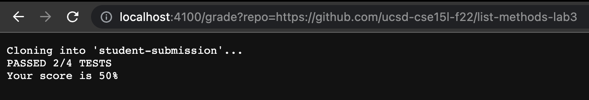
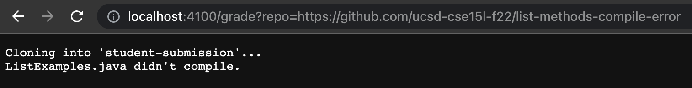
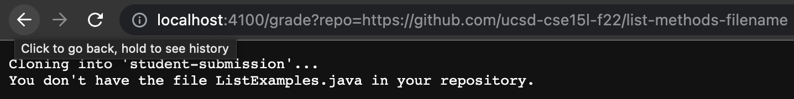

# Auto-Grader
### Grade.sh
```
rm -rf student-submission
rm -rf student-code-and-test
git clone $1 student-submission

CP=".:lib/hamcrest-core-1.3.jar:lib/junit-4.13.2.jar"
mkdir student-code-and-test
cp TestListExamples.java student-code-and-test

cd student-submission

if [[ ! -f "ListExamples.java" ]]
then 
    echo "You don't have the file ListExamples.java in your repository."
    exit 1
fi

cp ListExamples.java ../student-code-and-test
cd ../student-code-and-test


mkdir lib
cp ../hamcrest-core-1.3.jar ./lib
cp ../junit-4.13.2.jar ./lib

javac -cp $CP *.java 2> errors.txt

if [[ ! $? -eq 0 ]]
then 
    echo "ListExamples.java didn't compile."
    exit 1
fi

java -cp $CP org.junit.runner.JUnitCore TestListExamples > output.txt

if grep --quiet "OK (4 tests)" output.txt
then
    echo "PASSED 4/4 TESTS"
    echo "Your score is 100%"  
elif grep --quiet "Failures: 1" output.txt
then
    echo "PASSED 3/4 TESTS"
    echo "Your score is 75%"  
elif grep --quiet "Failures: 2" output.txt
then
    echo "PASSED 2/4 TESTS"
    echo "Your score is 50%"  
elif grep --quiet "Failures: 3" output.txt
then
    echo "PASSED 1/4 TESTS"
    echo "Your score is 25%"  
fi
```

### Example Grades of Student Submissions

 




### Trace
The repository I am tracing is https://github.com/ucsd-cse15l-f22/list-methods-lab3.

Line 1-2: "rm -rf" goes through a directory and recursively removes everything (files, subdirectories, and so on) in that directory, including the actual directory. This command is forced which means it doesn't ask for confirmation. After these commands are run, the student-submission and student-code-and-test directories no longer exist. No standard output or standard error. Each return code was 0. 

Line 3: The standard output was 
```
Cloning into 'student-submission'...
remote: Enumerating objects: 3, done.
remote: Counting objects: 100% (3/3), done.
remote: Compressing objects: 100% (2/2), done.
remote: Total 3 (delta 0), reused 3 (delta 0), pack-reused 0
Receiving objects: 100% (3/3), done.
```
No standard error. Return code was 0. This command cloned a repository and put its contents in a new directory called student-submission.

Line 5-9: No standard output or standard error. Each return code was 0. On line 5, a variable CP was created and some text needed for JUnit is stored in CP. On line 6, a new directory called student-code-and-test was created. On line 7, TestListExamples.java was copied into the student-code-and-test directory. On line 9, we cd'ed into the student-submission directory. The working directory is now student-submission.

Line 11: The condition for this if statement was false because this repository does have a file named ListExamples.java.

Lines 12-15: These lines didn't run because the condition for the if statement on line 11 was false.

Lines 17-24: No standard output or standard error. Each return code was 0. On line 17, ListExamples.java was copied into the student-code-and-test repository. On line 18, we cd'ed into the student-code-and-test directory. The working directory is now student-code-and-test. On line 20, we made a new directory inside student-code-and-test called lib. On lines 21 and 22, we copied some files for JUnit into the lib directory. On line 24, we compiled all the .java files with javac.

Line 26: The condition for this if statement was false because the exit code from the previous javac command on line 24 was 0.

Lines 27-30: These lines didn't run because the condition for the if statement on line 26 was false.

Line 32: The standard error was 
```
JUnit version 4.13.2
.E..E.
Time: 0.008
There were 2 failures: 1) testfilter1(TestListExamples)
java.lang.AssertionError: expected:<[dog, cat]> but was:<[cat, dog]>
	at org.junit.Assert.fail(Assert.java:89)
	at org.junit.Assert.failNotEquals(Assert.java:835)
	at org.junit.Assert.assertEquals(Assert.java:120)
	at org.junit.Assert.assertEquals(Assert.java:146)
	at TestListExamples.testfilter1(TestListExamples.java:28)
2) testfilter3(TestListExamples)
java.lang.AssertionError: expected:<[cat, dog, cat, cat]> but was:<[cat, cat, dog, cat]>
	at org.junit.Assert.fail(Assert.java:89)
	at org.junit.Assert.failNotEquals(Assert.java:835)
	at org.junit.Assert.assertEquals(Assert.java:120)
	at org.junit.Assert.assertEquals(Assert.java:146)
	at TestListExamples.testfilter3(TestListExamples.java:61)

FAILURES!!!
Tests run: 4,  Failures: 2
``` 
No standard output. Return code was 1. This command ran TestListExamples.java which had the JUnit tests.

Line 34: The grep command returned 1 as an exit code which means it didn't find the string in the file and the condition for the if statement is false because 1 means false in bash.

Lines 35-37: These lines didn't run because the condition for the if statement on line 34 was false.

Line 38: The grep command returned 1 as an exit code which means it didn't find the string in the file and the condition for the if statement is false because 1 means false.

Lines 39-41: These lines didn't run because the condition for the if statement on line 38 was false.

Line 42: The grep command returned 0 as an exit code which means it found the string in the file and the condition for the if statement is true because 0 means true in bash.

Line 43-45: The standard output was
```
PASSED 2/4 TESTS
Your score is 50%
```
No standard error. Return code was 0. The standard output is from the two echo commands.

Line 46: The grep command returned 1 as an exit code which means it didn't find the string in the file and the condition for the if statement is false because 1 means false.

Lines 47-49: These lines didn't run because the condition for the if statement on line 46 was false.

Line 50: This line ended the if/elif statements. No standard output or error. Return code was 0.